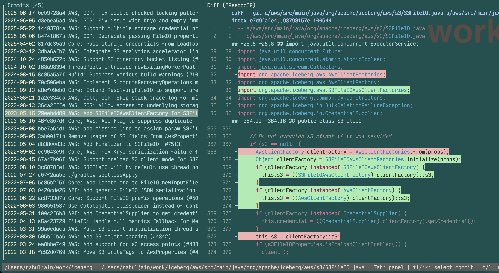
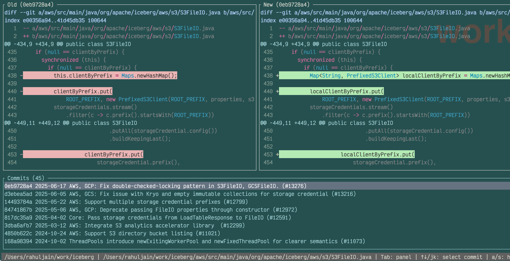

# Geschichte

**A blazingly fast terminal UI for viewing git file history and diffs**

[](https://www.rust-lang.org/)
[](https://opensource.org/licenses/MIT)
[](https://github.com/ratatui-org/ratatui)

Geschichte (German for "history") is a fast, keyboard-driven terminal UI for exploring git file history. Navigate through commits, view diffs, and understand how your files evolved over time—all without leaving your terminal.

Unlike full-featured git clients, Geschichte focuses specifically on **single-file history exploration**. It's designed for developers who want to quickly understand how a particular file changed over time, not for managing branches, commits, or other git operations. Think of it as a specialized tool that does one thing exceptionally well: showing you the story of your file.

Geschichte is not meant to replace your favorite git tools. Instead, it complements them by providing a fast, focused way to explore file history directly in your terminal. Geschichte is a read-only client for git history, allowing you to view and understand changes without the overhead of a full git client.

I wrote this because I was badly missing this feature in 'Zed', my primary IDE. Geschichte can be opened in a terminal window in your favorite IDE.

### Screenshots
**Default view with file picker and commit history**



**Side by side view**


## Features

### Core Functionality
- **Interactive file picker** - Fuzzy search and select any tracked file with popup interface
- **File history visualization** with commit dates, hashes, authors, and subjects
- **Working directory support** - See uncommitted changes as the top entry
- **Interactive navigation** with vim-style keybindings and focus-aware panels
- **Colorized diffs** with visual highlighting for additions, deletions, and context
- **Commit-to-commit diff** - Select any two commits to see changes between them
- **Rename tracking** - Follow files across renames and moves (with `--follow`)
- **Performance optimized** with LRU caching for instant diff switching
- **Split-pane interface** with resizable panels and help overlay
- **Side-by-side diff view** - Three-panel layout with old/new file comparison

### Enhanced Commit Information
- **Detailed commit popups** - View comprehensive commit metadata with scrollable interface
- **Copy functionality** - Copy commit SHA, message, author, date, or GitHub URLs to clipboard
- **Enhanced commit metadata** - Author/committer details, timestamps, refs, and PR information
- **Pull request detection** - Automatic detection and display of GitHub PR information from commit messages
- **Branch and tag refs** - See which branches and tags contain each commit
- **Commit statistics** - View files changed, insertions, and deletions for each commit

### User Experience
- **Seamless file switching** - Switch between files without losing context using 'f' key
- **Mac-friendly navigation** - Multiple scroll options (PageUp/Down, Ctrl+D/U, Ctrl+F/B)
- **Mouse support** - Scrolling support with mouse
- **Focus-aware controls** - Arrow keys work differently based on active panel
- **Comprehensive keybindings** - Vim, emacs, and traditional navigation styles
- **Merge commit handling** - Proper parent resolution for complex histories
- **Configurable context** - Adjust diff context lines via CLI arguments

## Installation

### From Source (Current)
```bash
git clone https://github.com/yourusername/geschichte.git
cd geschichte
cargo build --release
cargo install --path .
```

### Using Cargo (Coming Soon)
```bash
cargo install geschichte
```

### Homebrew (Planned)
```bash
brew install geschichte
```

## Zed Integration
Geschichte can be integrated into the [Zed](https://zed.dev) IDE for a seamless development experience. You can open Geschichte in a terminal window within Zed to quickly access file history. To set up Geschichte in Zed, follow these steps:
1. Open Zed and go to the settings.
2. Create a Task in ~/config/zed/tasks.json with the following configuration:
```json
{
  "label": "Geschichte - Show File history",
  "command": "geschichte \"$ZED_RELATIVE_FILE\"",
}
```
3. Use custome key bindings to run the task, or run it from the command palette.
```json
[
	{
  "context": "Workspace",
  "bindings": {
    "alt-g": [
      "task::Spawn",
      { "task_name": "Geschichte - Show file history", "reveal_target": "center" }
    ]
  }
}
]
```

## Usage

### Basic Usage
```bash
# Open file picker to browse and select any tracked file
geschichte

# View history for a specific file
geschichte src/main.rs
geschichte README.md
geschichte path/to/any/file.txt
```

### Command Line Options
```bash
geschichte [OPTIONS] [FILE]

Arguments:
  [FILE]  Path to the file to view history for (optional - opens file picker if not provided)

Options:
  -C, --repo <DIR>             Repository root directory (auto-discovered if not specified)
  -L, --lines <CONTEXT_LINES>  Number of context lines in diffs [default: 3]
      --full-file              Show full file content in diffs instead of just context around changes
  -s, --side-by-side           Enable side-by-side diff view (three-panel layout)
      --layout <MODE>          Layout mode: unified, side-by-side, or auto [default: unified]
      --first-parent           Show only first-parent commits (linearize merges)
      --no-follow              Disable rename tracking
      --debug                  Enable debug logging
  -h, --help                   Print help
  -V, --version                Print version
```

### Examples
```bash
# Open file picker to browse all tracked files
geschichte

# Side-by-side diff view (three-panel layout)
geschichte --side-by-side src/main.rs
geschichte -s README.md

# Auto layout mode (switches based on terminal width)
geschichte --layout auto src/app.rs

# More context in diffs
geschichte -L 10 src/main.rs

# Show full file content in diffs (useful for small files)
geschichte --full-file src/config.rs

# Disable rename tracking for performance
geschichte --no-follow large-file.txt

# Linear history only (ignore merge commits)
geschichte --first-parent main.rs

# Combine options
geschichte -s -L 5 --first-parent src/main.rs
geschichte --full-file --side-by-side README.md
```

## Keybindings

### Navigation
| Key | Action |
|-----|--------|
| `Tab` | Switch between commit list and diff panels |
| `↑↓` / `j/k` | Navigate commits OR scroll diff (focus-aware) |
| `h/l` | Resize split panes |

### Scrolling (Multiple Options)
| Key | Action | Style |
|-----|--------|-------|
| `PageUp/PageDown` | Scroll diff | Traditional |
| `Ctrl+U/Ctrl+D` | Scroll diff | Vim-style |
| `Ctrl+B/Ctrl+F` | Scroll diff | Emacs-style |

### File Switching & Range Selection
| Key | Action |
|-----|--------|
| `f` | Open file picker to switch to another file |
| `d` | Mark/diff between commits - select two commits to compare |

### Commit Information & Copy
| Key | Action |
|-----|--------|
| `i` / `Enter` | Show detailed commit information popup |
| `y` | Start copy mode - then press target key |
| `yy` | Copy full commit SHA (vim-style) |
| `Y` | Copy short commit SHA |
| `c` | Copy full commit SHA (in popup) |

### Copy Mode Targets (after pressing `y`)
| Key | Action |
|-----|--------|
| `s` | Copy full SHA |
| `h` | Copy short SHA |
| `m` | Copy commit message (subject + body) |
| `a` | Copy author name and email |
| `d` | Copy commit date |
| `u` | Copy GitHub/GitLab URL |
| `y` | Copy full SHA (same as `s`) |

### File Picker (when open)
| Key | Action |
|-----|--------|
| `↑↓` / `Ctrl+P/N` | Navigate file list |
| `Enter` | Select file and view history |
| `Esc` | Return to previous file (or quit if no previous file) |
| Type characters | Fuzzy search files |
| `Ctrl+U` | Clear search |

### General
| Key | Action |
|-----|--------|
| `?` | Show/hide help overlay |
| `q` / `Esc` | Quit (context-aware) |

## Side-by-Side Diff View

Geschichte offers a powerful three-panel layout that shows old and new file versions side-by-side, making it easier to compare changes visually.

### Layout Modes

- **Unified (default)**: Traditional two-panel layout with commits on left, unified diff on right
- **Side-by-Side**: Three-panel layout with old/new files on top, commits on bottom
- **Auto**: Automatically switches based on terminal width (≥120 characters for side-by-side)

### Three-Panel Layout Structure

```
┌─ Old File (deletions) ────────┐┌─ New File (additions) ─────────┐
│  1  fn calculate() {           ││  1  fn calculate(x: i32) {     │
│  2 -    let result = 10;       ││  2 +    let result = x * 2;    │
│  3      println!("{}", result);││  3      println!("{}", result);│
│                                ││  4 +    // Return the value    │
│                                ││  5 +    result                 │
├────────────────────────────────┴─────────────────────────────────┤
│ > Working Dir  Modified                                          │
│   2025-08-17  abc123  Add parameter to calculate function        │
│   2025-08-16  def456  Initial implementation                     │
└───────────────────────────────────────────────────────────────────┘
```

### Features in Side-by-Side Mode

- **Syntax highlighting**: Full language-aware highlighting in both panels
- **Line numbers**: Accurate line numbers for old and new versions
- **Background colors**: Deletions highlighted in red (left), additions in green (right)
- **Synchronized scrolling**: Both panels scroll together for easy comparison
- **Dynamic titles**: Panel headers show commit hashes being compared
- **Full feature parity**: All unified mode features work in side-by-side mode

### When to Use Each Mode

- **Unified mode**: Better for reviewing overall changes, seeing context, and narrow terminals
- **Side-by-side mode**: Ideal for comparing implementations, refactoring reviews, and wide screens
- **Auto mode**: Let Geschichte choose the best layout based on your terminal size

## Commit-to-Commit Diff

Geschichte allows you to compare any two commits to see exactly what changed between them. This is perfect for understanding the evolution of your code across multiple commits.

### How to Use Range Diff

1. **Mark First Commit**: Navigate to any commit and press `d` - you'll see a green `► ` marker
2. **Select Second Commit**: Navigate to another commit and press `d` again
3. **View Diff**: The diff panel automatically updates to show changes between the two commits
4. **Clear Selection**: Press `Esc` to clear the selection and return to normal mode

### Visual Indicators

- **Green `► ` arrow**: Shows which commit is marked for comparison
- **Header format**: `Diff (older..newer)` shows the range being compared
- **Selection mode**: `Diff (abc123) [Selecting...]` when first commit is marked
- **Chronological order**: Always shows older→newer regardless of selection order

### Example Workflow

```bash
# 1. Navigate to an older commit (bottom of history)
# 2. Press 'd' → see green arrow marker
# 3. Navigate to newer commit (top of history)
# 4. Press 'd' → see diff between the commits
# 5. Green lines show code added in newer commit
# 6. Red lines show code removed from older commit
```

The range diff works across any two commits - compare your working directory with any historical commit, or see what changed between two releases!

## Detailed Commit Information

Geschichte provides comprehensive commit metadata through an interactive popup that shows everything you need to know about a commit.

### How to Access

- **From commit list**: Press `i` or `Enter` on any commit
- **Navigation**: Use `↑↓` or `j/k` to scroll through the popup content
- **Copy shortcuts**: Press `c` to copy the commit SHA directly from the popup
- **Close**: Press `q` or `Esc` to close the popup

### What's Included

**Basic Information**:
- Full commit SHA (clickable/copyable)
- Author name and email
- Commit date and time
- Subject line

**Extended Metadata** (when available):
- Committer information (if different from author)
- Commit timestamp (if different from author date)
- Branch and tag references
- Pull request information (auto-detected from commit messages)
- Commit statistics (files changed, insertions, deletions)

**Full Message Content**:
- Complete commit message body
- Scrollable interface for long messages
- Preserves original formatting

### Copy Integration

The commit popup integrates seamlessly with the copy system - you can copy any commit information directly from the detailed view without leaving the popup.

### Example Popup Content

```
┌─ Commit Details ──────────────────────────────────┐
│ Hash:      abc123def456789abcdef123456789abcdef12 │
│ Author:    Jane Developer <jane@company.com>      │
│ Date:      2023-08-15 14:30:22                    │
│ Refs:      (branch:main, tag:v1.2.0)             │
│ PR:        #142 - Add authentication system       │
│ Stats:     5 files, +120 -30 lines               │
│                                                   │
│ ┌─ Full Message ─────────────────────────────────┐ │
│ │ Implement user authentication system           │ │
│ │                                                │ │
│ │ Added JWT token support and password hashing.  │ │
│ │                                                │ │
│ │ This commit includes:                          │ │
│ │ - JWT token generation                         │ │
│ │ │ - Password validation                          │ │
│ │ │ - Session management                           │ │
│ │ └─────────────────────────────────────────────────┘ │
│ [↑↓/jk] Scroll  [c] Copy hash  [Esc/q] Close         │
└────────────────────────────────────────────────────────┘
```

### Coming Soon
| Key | Action |
|-----|--------|
| `/` | Search in diff |
| `m` | Cycle merge parents |

## Interface

### File Picker Mode
```
                   ┌─ Select File ─────────────────────────┐
                   │ ┌─ Search ─────────────────────────┐ │
                   │ │ 🔍 main                          │ │
                   │ └─────────────────────────────────────┘ │
                   │ ▲ src/main.rs        Modified     │
                   │ > src/app.rs         2024-08-15   │
                   │   src/cli.rs         2024-08-14   │
                   │   README.md          2024-08-13   │
                   │   Cargo.toml         2024-08-12   │
                   │   ...                              │
                   │ 📁 42 files • 4 matches • ↑↓: navigate • Enter: select • Esc: quit
                   └───────────────────────────────────────┘
```

### History View Mode
```
┌─ Commits ─────────────────────┐┌─ Diff ─────────────────────────┐
│ > Working Dir Modified        ││ diff --git a/src/main.rs       │
│   2025-08-15 77942bc Latest   ││ @@ -10,6 +10,8 @@ fn main() { │
│   2025-08-14 3f30143 Feature  ││  fn main() {                   │
│   2025-08-13 603c9b0 Phase-2  ││ -    println!("Hello");       │
│   ...                         ││ +    println!("Hello, world!");│
└───────────────────────────────┘└─────────────────────────────────┘
[main.rs@77942bc] Tab: switch panels | f: switch file | d: range diff | ?: help
```

### Range Diff Mode
```
┌─ Commits ─────────────────────┐┌─ Diff (603c9b0..77942bc) ─────┐
│   Working Dir Modified        ││ diff --git a/src/main.rs       │
│ ► 2025-08-15 77942bc Latest   ││ @@ -15,4 +15,12 @@ fn handle() { │
│   2025-08-14 3f30143 Feature  ││  fn handle() {                 │
│ ► 2025-08-13 603c9b0 Phase-2  ││ +    // New error handling     │
│   ...                         ││ +    if error.is_fatal() {     │
└───────────────────────────────┘└─────────────────────────────────┘
[Range: 603c9b0..77942bc] Shows changes between two selected commits
```

## Why Geschichte?

**Fast & Focused**: Unlike heavyweight GUI tools, Geschichte is built for speed and terminal workflows.

**Rename-Aware**: Tracks files across renames and moves, showing the complete evolution of your code.

**Working Directory Integration**: See your uncommitted changes alongside git history in one unified view.

**Keyboard-Driven**: Efficient navigation with vim-style keybindings, plus Mac-friendly alternatives.

**Developer-Friendly**: Built by developers, for developers who live in the terminal.

## 🛣Roadmap

### Recently Completed ✅
- **Copy commit hash** - Quick clipboard integration with multiple formats
- **Detailed commit information** - Comprehensive metadata popups
- **Enhanced commit metadata** - Author/committer details, refs, PR detection
- **Commit statistics** - Files changed, insertions, deletions display

### Upcoming Features
- **In-diff search** - Search within diff content with regex support
- **Merge parent cycling** - Navigate through merge commit parents
- **Enhanced copy options** - More format options and integrations

### Future Enhancements
- **Performance optimizations** - Handle massive repositories efficiently
- **Enhanced syntax highlighting** - More language support and themes
- **Configuration files** - Customizable themes and keybindings
- **Blame view** - See who changed each line and when
- **Commit editing workflows** - Interactive rebase, cherry-pick support

## Contributing

Contributions are welcome! Please see [CONTRIBUTING.md](CONTRIBUTING.md) for guidelines.

### Development Setup
```bash
git clone https://github.com/yourusername/geschichte.git
cd geschichte
cargo build
cargo run -- src/main.rs
```

### Running Tests
```bash
cargo test
cargo clippy
cargo fmt
```

## Performance

- **Startup time**: < 500ms for typical repositories
- **Memory usage**: < 20MB for 1000+ commits
- **Diff caching**: LRU cache holds 50 diffs for instant navigation
- **Large repositories**: Tested with 10k+ commit histories

## Dependencies

Built with these excellent Rust crates:
- [ratatui](https://github.com/ratatui-org/ratatui) - Terminal UI framework
- [crossterm](https://github.com/crossterm-rs/crossterm) - Cross-platform terminal manipulation
- [clap](https://github.com/clap-rs/clap) - Command line parsing
- [anyhow](https://github.com/dtolnay/anyhow) - Error handling
- [arboard](https://github.com/1Password/arboard) - Cross-platform clipboard access

## License

This project is licensed under the MIT License - see the [LICENSE](LICENSE) file for details.

## Acknowledgments

- Inspired by `tig`, `lazygit`, and other excellent terminal git tools
- Built with the amazing Rust ecosystem
- Special thanks to the `ratatui` community for the excellent TUI framework

---

**Etymology**: *Geschichte* is German for "history" or "story" - fitting for a tool that helps you explore the story of your code.
